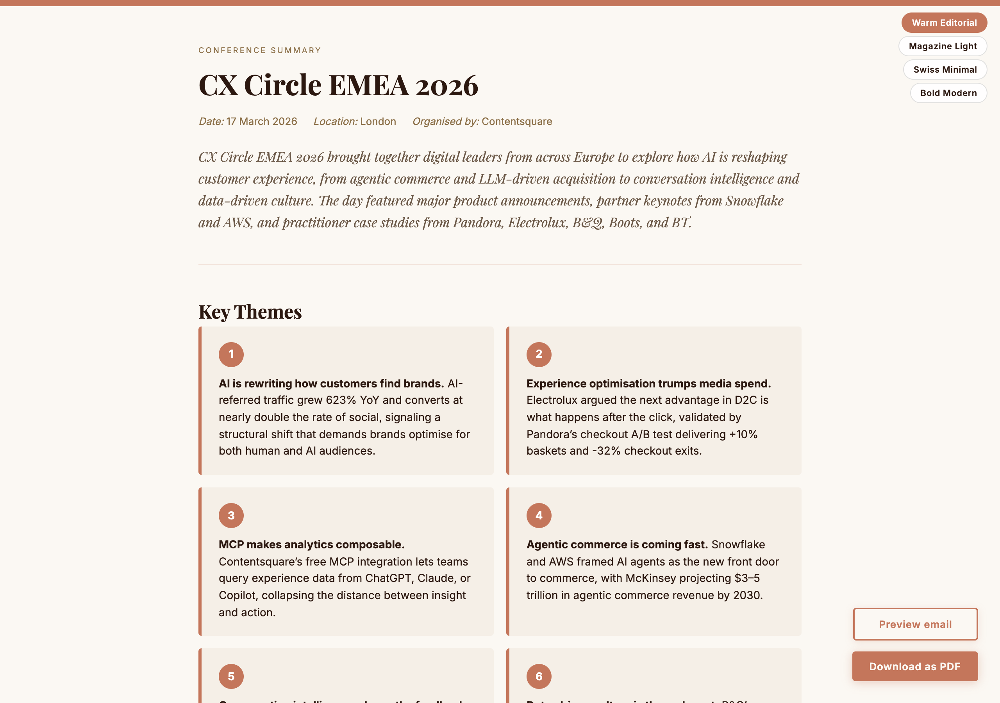

# field-notes

A Claude Code skill that transforms raw, incomplete notes taken at real-world events into polished, ready-to-share documents.



## The problem it solves

You were physically somewhere — a conference, trade show, workshop, site visit, or talk. You took sparse notes: a speaker name, a keyword, a photo of a slide. Now you need to turn those fragments into something others can read.

This is a **notes-from-presence** problem. It's distinct from audio transcription tools (Granola, Otter, Fireflies) which process recordings in real time. This skill works from the incomplete notes and photos you took while being there.

## What it does

1. **Accepts raw notes + photos** in any format — bullet points, stream-of-consciousness, partial sentences, folders of photos
2. **Detects the event type** automatically (conference, trade show, workshop, site visit, talk)
3. **Fetches official reference material** — published agendas, company websites, trainer methodologies, speaker bios
4. **Matches notes and photos to official units** — session titles, booth names, module names
5. **Researches named entities** — companies, tools, frameworks, people mentioned in the notes
6. **Generates an elevated narrative** — not a repeat of raw notes, but a synthesized, shareable document
7. **Outputs both Markdown and a styled HTML page** with embedded photos, research panels, and an email-ready version

## Event types supported

| Type | Unit | Reference | Output label |
|---|---|---|---|
| Conference | Session | Published agenda | Conference Summary |
| Trade show | Company/booth | Company website | Trade Show Report |
| Workshop | Module/exercise | Trainer's methodology | Workshop Notes |
| Site visit | Observation area | Company website/news | Site Visit Report |
| Talk/lecture | Theme/segment | Speaker bio | Talk Summary |

## HTML output features

- **4 switchable design styles** — Warm Editorial, Magazine Light, Swiss Minimal, Bold Modern
- **Self-contained** — all photos base64-encoded inline, no external dependencies
- **Email preview** — generates a distilled Gmail-pasteable email version with a working "View full report" download button
- **Print-optimized** — PDF output via browser print matches the screen design
- **Responsive** — adapts to mobile viewports

### Design styles

| Style | Fonts | Accent |
|---|---|---|
| Warm Editorial (default) | Playfair Display + Inter | Terracotta `#C4765B` |
| Magazine Light | Cormorant Garamond + Jost | Steel blue `#2B4C7E` |
| Swiss Minimal | Inter | Black `#000000` |
| Bold Modern | Syne + Inter | Indigo `#4F46E5` |

## Photo handling

The skill uses a **usefulness-based inclusion rule** rather than a fixed cap per session:

- Include every photo that contains **unique, useful content** — a different slide, data point, speaker, or demo screen
- Drop only near-duplicates, blurry/unreadable shots, or pure recap slides where every element is captured better elsewhere
- Photos are read in batches, tagged with identifying signals, and matched to session units automatically

## Installation

### Option 1: Plugin Install (recommended)

```
/plugin marketplace add wentingwang21/field-notes
```

Then restart Claude Code. The skill will be available immediately.

### Option 2: Git Clone

```bash
git clone https://github.com/wentingwang21/field-notes.git ~/.claude/skills/field-notes
```

### Cursor

This skill uses Claude Code's `WebSearch`, `WebFetch`, `Read`, `Write`, and `Bash` tools. Cursor supports these capabilities but behavior may vary depending on your Cursor configuration.

**To install:**

```bash
git clone https://github.com/wentingwang21/field-notes.git ~/.claude/skills/field-notes
```

If your Cursor uses a different skills path, put `SKILL.md` at `field-notes/SKILL.md` inside that folder.

Once installed, the skill will be automatically available. Trigger it with phrases like:
- "Write up my conference notes"
- "Turn these notes into a document"
- "Clean up my field notes"
- "Notes from the trade show today"

### As a standalone prompt

You can also use `SKILL.md` as a system prompt or paste it into any Claude conversation to get the same behavior.

## Example usage

```
You: Here are my notes from the AI Summit yesterday. Photos are in ~/Desktop/Photos-Summit/

Session 1: Opening keynote
- CEO talked about AI agents replacing traditional search
- showed demo of chatbot ordering groceries
- 40% increase in AI traffic YoY

Session 2: Panel on data strategy
- panelist from Spotify said they treat data as a product
- interesting point about semantic layers
```

The skill will:
1. Read all photos and match them to sessions
2. Search for the AI Summit agenda to get official session titles and speaker names
3. Research named entities (Spotify's data strategy, semantic layers)
4. Generate a polished Markdown + HTML report with photos, research panels, and next steps

## Output structure

### Markdown
- Header with event metadata
- Key themes (5–7 synthesized takeaways)
- Session notes with elevated insights and further reading
- Next steps with priority badges

### HTML
- Same content in a styled, self-contained webpage
- Style switcher (4 themes)
- Embedded photos in responsive grids
- Research/further reading panels alongside each session
- Actionable next steps with checkboxes
- Email preview with download button
- Print/PDF optimized

## Requirements

- **Claude Code** with access to `WebSearch`, `WebFetch`, `Read`, `Write`, and `Bash` tools
- Photos should be in JPEG or PNG format
- Notes can be pasted directly or provided as a file path

## License

MIT
